# TFW My Circle of Concern Is Actually The Entire Universe

> Grant me the serenity to accept the things I cannot change...

If I take the massive pile of "the things I cannot change" they start to naturally fall into two piles. There's one pile that has "things I care about" and another that has everything else. I can remember a time when the "things I care about" pile was pretty small and had some clear boundaries. I've never intentionally thought "hey, I should really focus on growing this pile of stuff I care about" but that seems inconsequential as the pile just keeps growing on its own. At this point it feels like it's spilling over the edges. I know about things happening all over the world and even if they don't impact me directly they still generate anxiety and stress. 

In Stephen Covey's book "The 7 Habits of Highly Effective People," (if you bristle at the title and it makes you want to run away and wash the corporate out of your mouth I get it. I avoided the book for years on the basis of the title alone 😂! Trust me though, it's genuinely a good book.) he introduces this concept of the "Circle of Concern". When he first presents it it's with a chart that has a two basic parts: a big field of "no concern" and a "circle of concern" within that. If I rewind time a couple of decades, mentally I would have filled the details in with something like: 

```mermaid
graph TB
    subgraph NoConcern ["No Concern"]
        A["someone else, somewhere else, the distant future"]
        direction TB
        subgraph Concern ["Circle of Concern"]
           B["my basic needs, my relationships, my work"]
           direction TB
        end
    end

    A ~~~ Concern

    style NoConcern fill:#1a1214,stroke:#d9d8dc,stroke-width:2px,rx:60,ry:60
    style Concern fill:#2a1f22,stroke:#eb99a1,stroke-width:2px,rx:60,ry:60
```

These days I can't let the border be so rigid. The "someone else" inevitably becomes someone I care about, the "somewhere else" is actually a place that is being directly affected by the policies of the country I live in, and the fears I have about the "distant future" seem terrifyingly immanent. It feels like I'm back to one big unruly pile. 

```mermaid
graph TB
    subgraph NoConcern ["No Concern"]
        A["someone else, somewhere else, the distant future"]
        direction TB
        subgraph Concern ["Circle of Concern"]
           B["my basic needs, my relationships, my work"]
        end
    end

    A --> B

    style NoConcern fill:#1a1214,stroke:#d9d8dc,stroke-width:2px,rx:60,ry:60
    style Concern fill:#2a1f22,stroke:#eb99a1,stroke-width:2px,rx:60,ry:60,stroke-dasharray: 6 4
```

Part of this is due to the constant firehose of information coming my way. I often feel like I'm drowning in it, but to disengage feels wrong. I think I'm afraid that if I don't care I'll grow callous. The problem is, it's really easy for this giant pile of care or concern to become a big ball of crippling anxiety. The reality is, if my circle of concern is all the things, I can't actually care about anything. 

Lately I've been trying to go back to a practice of feeling my feelings, acknowledging them, and then letting them go. I can't "fix" the vast majority of things that cause me anxiety. I can't change them. It's like "spend a few seconds screaming about the things I can't change, then let them go." One of the things I've realized is somewhere along the way I equated accepting the fact that I don't have any control or influence over some things with being okay with the state of those things. I can rage at injustice and inequity and still accept that I cannot change them. In reality not accepting that means I don't have any energy left to focus on the stuff I can control and influence. 

So for me, things actually start with redrawing my map. Instead of a circle of concern I'm starting with a bounded circle of focus. Where does my focus start? On me. Where does it extend? To those in closest proximity to me. What time frame am I most concerned with? Right now and the immediate future. Focus. Accept what I can't change outside of that. Accept what I can't change inside as well. Then I'm ready to move forward. 

```mermaid
graph TB
    subgraph NoConcern ["The Universe"]
        A["All of the problems across time and space"]
        direction TB
        subgraph Concern ["Circle of Focus"]
           B["me, now, here"]
           direction TB
        end
    end

    A ~~~ Concern

    style NoConcern fill:#1a1214,stroke:#d9d8dc,stroke-width:2px,rx:60,ry:60
    style Concern fill:#2a1f22,stroke:#eb99a1,stroke-width:2px,rx:60,ry:60
```

Serenity and acceptance are a great starting point if you want to actually do something meaningful. Worry and anxiety really don't do anything for anyone. I often try and jump ahead to the circles of influence and control, or in the terminology of the Serenity Prayer "the courage to change the things I can". Misplaced courage just leads to running without direction, slamming into walls or other obstacles, taking damage unnecessarily, etc... 

I'll post more thoughts on influence, control, courage, and wisdom in the future. For now the big thing I've been realizing is that for me, care and concern quickly turn into anxiety and that leaves me in a place where I don't even know where to focus. Redrawing a circle of focus and mapping concern and control inside of that sphere has been a huge step forward. 

Side note: I'll probably write about this more in the future, but I used to see fear as an enemy to be vanquished and as a result I've been suppressing a ton of anxiety and living in denial that it exists. I've had this huge internal check engine light flashing in my face for years, and I'm only recently starting to see it for what it is. Accepting the things I cannot change involves a little bit of "making friends with fear" for me. 

> Grant me the serenity to accept the things I cannot change, the courage to change the things I can, and the wisdom to know the difference. - Serenity Prayer, Reinhold Niebuhr